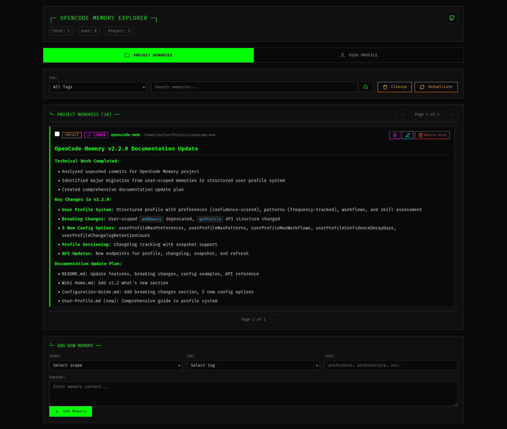
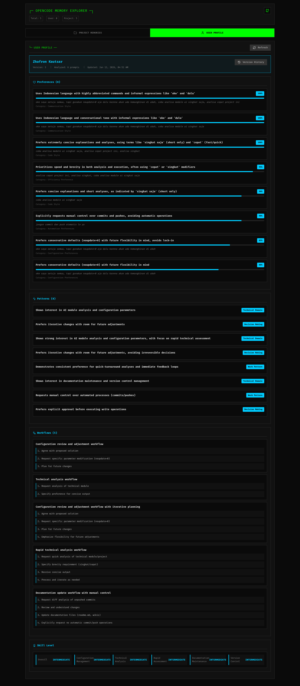

# OpenCode Memory


A persistent memory system for AI coding agents that enables long-term context retention across sessions using local vector database technology.

## Overview

OpenCode Memory provides AI coding agents with the ability to remember and recall information across conversations. It uses vector embeddings and SQLite for efficient storage and retrieval of contextual information.

## Key Features

- **Local Vector Database**: SQLite-based storage with sqlite-vec extension
- **Dual Memory Scopes**: Separate user-level and project-level memory contexts
- **Unified Timeline**: Browse memories and prompts together with linking support
- **Prompt-Memory Linking**: Bidirectional links between prompts and generated memories
- **User Profile System**: Structured learning with preferences, patterns, workflows, and skill assessment
- **Web Interface**: Full-featured UI for memory management and search
- **Auto-Capture System**: Intelligent prompt-based memory extraction
- **Multi-Provider AI**: Support for OpenAI, Anthropic, and OpenAI-compatible APIs
- **Flexible Embedding Models**: 12+ local models or OpenAI-compatible APIs
- **Smart Deduplication**: Prevents redundant memories using similarity detection
- **Privacy Protection**: Built-in content filtering for sensitive information

## Installation

Add the plugin to your OpenCode configuration:

**Location**: `~/.config/opencode/opencode.json` or `opencode.jsonc`

```jsonc
{
  "plugins": [
    "opencode-mem"
  ]
}
```

OpenCode will automatically download and install the plugin on next startup.

### Install from Source

```bash
git clone https://github.com/tickernelz/opencode-mem.git
cd opencode-mem
bun install
bun run build
```

## Quick Start

### Basic Usage

```typescript
memory({ mode: "add", content: "Project uses microservices", scope: "project" })
memory({ mode: "search", query: "architecture decisions", scope: "project" })
memory({ mode: "profile" })
```

**Note**: User-scoped `add` is deprecated in v2.2+. Use profile system instead.

### Web Interface

Access at `http://127.0.0.1:4747` to browse memories, view prompt-memory links, and manage your memory database.

**Project Memory Timeline:**



**User Profile Viewer:**



### Configuration

Configuration file: `~/.config/opencode/opencode-mem.jsonc`

```jsonc
{
  "storagePath": "~/.opencode-mem/data",
  "embeddingModel": "Xenova/nomic-embed-text-v1",
  "webServerEnabled": true,
  "webServerPort": 4747,
  "autoCaptureEnabled": true,
  "memoryProvider": "openai-chat",
  "memoryModel": "gpt-4",
  "memoryApiUrl": "https://api.openai.com/v1",
  "memoryApiKey": "sk-...",
  "userMemoryAnalysisInterval": 10,
  "userProfileMaxPreferences": 20,
  "userProfileMaxPatterns": 15,
  "userProfileMaxWorkflows": 10,
  "userProfileConfidenceDecayDays": 30,
  "userProfileChangelogRetentionCount": 5
}
```

## Breaking Changes (v2.2)

**User-scoped memories deprecated in favor of structured user profiles:**

- Removed: User-scoped `addMemory` (now returns error)
- Changed: `memory({ mode: "profile" })` returns new structure (preferences/patterns/workflows/skillLevel)
- Added: 5 new config options for profile management
- New behavior: User learning creates/updates structured profile instead of individual memories
- Migration: Existing user memories remain readable but new ones cannot be created

**Migration required**: Update code using `mode: "profile"` to handle new structure.

## Breaking Changes (v2.0)

**Token-based auto-capture has been replaced with prompt-based system:**

- Removed: `autoCaptureTokenThreshold`, `autoCaptureMinTokens`, `autoCaptureMaxMemories`, `autoCaptureSummaryMaxLength`, `autoCaptureContextWindow`
- Added: `memoryProvider`, `userMemoryAnalysisInterval`, `autoCaptureMaxIterations`, `autoCaptureIterationTimeout`
- New behavior: Triggers on session idle, analyzes last uncaptured prompt
- Automatic skip logic for non-technical conversations
- Prompt-memory linking with cascade delete support

**Migration required**: Remove deprecated config options and add new ones.

## Documentation

For detailed documentation, see the [Wiki](https://github.com/tickernelz/opencode-mem/wiki):

- [Installation Guide](https://github.com/tickernelz/opencode-mem/wiki/Installation-Guide)
- [Quick Start](https://github.com/tickernelz/opencode-mem/wiki/Quick-Start)
- [Configuration Guide](https://github.com/tickernelz/opencode-mem/wiki/Configuration-Guide)
- [User Profile System](https://github.com/tickernelz/opencode-mem/wiki/User-Profile)
- [Memory Operations](https://github.com/tickernelz/opencode-mem/wiki/Memory-Operations)
- [Auto-Capture System](https://github.com/tickernelz/opencode-mem/wiki/Auto-Capture-System)
- [Web Interface](https://github.com/tickernelz/opencode-mem/wiki/Web-Interface)
- [Embedding Models](https://github.com/tickernelz/opencode-mem/wiki/Embedding-Models)
- [Performance Tuning](https://github.com/tickernelz/opencode-mem/wiki/Performance-Tuning)
- [Troubleshooting](https://github.com/tickernelz/opencode-mem/wiki/Troubleshooting)

## Features Overview

### Memory Scopes

- **User Scope**: Cross-project preferences, coding style, communication patterns
- **Project Scope**: Architecture decisions, technology stack, implementation details

### Auto-Capture System

Automatically extracts memories from conversations:

1. Triggers on session idle
2. Analyzes last uncaptured prompt and response
3. Links memory to source prompt
4. Skips non-technical conversations

### User Profile System

Builds structured user profile from conversation history (default: every 10 prompts):

- **Preferences**: Code style, communication style, tool preferences (with confidence scores)
- **Patterns**: Recurring topics, problem domains, technical interests (with frequency tracking)
- **Workflows**: Development sequences, habits, learning style
- **Skill Level**: Overall and per-domain assessment

Profile includes versioning, changelog, and confidence decay mechanism.

### Web Interface

- Unified timeline of memories and prompts
- User profile viewer with changelog
- Visual prompt-memory link indicators
- Cascade delete for linked items
- Bulk operations
- Search and filters
- Maintenance tools (cleanup, deduplication)

## API Reference

### Memory Tool

```typescript
memory({ mode: "add", content: "...", scope: "project" })
memory({ mode: "search", query: "...", scope: "user|project" })
memory({ mode: "list", scope: "user|project", limit: 10 })
memory({ mode: "profile" })
memory({ mode: "forget", memoryId: "..." })
memory({ mode: "auto-capture-toggle" })
memory({ mode: "auto-capture-stats" })
memory({ mode: "capture-now" })
```

**Note**: `scope: "user"` for `add` mode is deprecated in v2.2+.

### REST API

**Memory & Prompt Management:**
- `GET /api/memories?scope=project&includePrompts=true` - List memories/prompts
- `POST /api/memories` - Create memory
- `PUT /api/memories/:id` - Update memory
- `DELETE /api/memories/:id?cascade=true` - Delete memory (and linked prompt)
- `DELETE /api/prompts/:id?cascade=true` - Delete prompt (and linked memory)
- `POST /api/search` - Vector search

**User Profile:**
- `GET /api/profile` - Get user profile
- `GET /api/profile/changelog?limit=5` - Get profile changelog
- `GET /api/profile/snapshot/:changelogId` - Get profile snapshot
- `POST /api/profile/refresh` - Force profile refresh

**Maintenance:**
- `POST /api/cleanup` - Run cleanup
- `POST /api/deduplicate` - Run deduplication

## Development

```bash
bun install
bun run dev
bun run build
bun run format
bun run typecheck
```

## License

MIT License - see LICENSE file for details

## Acknowledgments

Inspired by [opencode-supermemory](https://github.com/supermemoryai/opencode-supermemory)

## Links

- **Repository**: https://github.com/tickernelz/opencode-mem
- **Wiki**: https://github.com/tickernelz/opencode-mem/wiki
- **Issues**: https://github.com/tickernelz/opencode-mem/issues
- **OpenCode Platform**: https://opencode.ai
